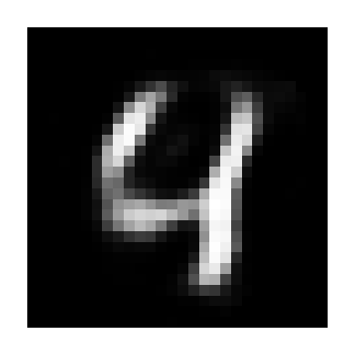

# Image Denoising Autoencoder

A deep learning project that uses an autoencoder to remove artificial noise from handwritten digit images using the MNIST dataset.

## 📌 Overview

Image denoising is the process of recovering a clean image from a noisy version of the same image.

In this project, Gaussian noise is intentionally added to MNIST handwritten digit images. An autoencoder is then trained to reconstruct the original clean images from their noisy versions.

The model learns to capture the important features of the input images in a compact latent representation and uses that representation to reconstruct a cleaner image.

## 🎯 Objective

The objective of this project is to build and train an autoencoder capable of learning how to reconstruct clean handwritten digit images from noisy inputs.

## 📊 Dataset

This project uses the **MNIST handwritten digit dataset**.

* Image size: `28 × 28` pixels
* Image type: Grayscale
* Classes: Digits `0–9`
* Training samples: `60,000`
* Test samples: `10,000`

The pixel values are normalized from the original `0–255` range to `0–1`.

## 🔊 Noise Generation

Gaussian noise is added to the original images before they are provided to the autoencoder.

The noise factor used in this project is:

```text
0.3
```

After adding noise, pixel values are clipped to the range `[0, 1]`.

```python
x_noisy = x + noise_factor * np.random.normal(
    loc=0.0,
    scale=1.0,
    size=x.shape
)

x_noisy = np.clip(x_noisy, 0., 1.)
```

The noisy images are used as the model input, while the original clean images are used as the target output.

## 🧠 Autoencoder Architecture

The model consists of an encoder and decoder.

### Encoder

```text
Input: 28 × 28
       ↓
Flatten: 784
       ↓
Dense: 128 neurons
ReLU activation
       ↓
Latent representation: 64 neurons
ReLU activation
```

### Decoder

```text
Latent representation: 64
       ↓
Dense: 128 neurons
ReLU activation
       ↓
Dense: 784 neurons
Sigmoid activation
       ↓
Reshape: 28 × 28
```

### Complete Architecture

```text
Noisy Image (28 × 28)
        ↓
     Flatten
        ↓
Dense (128, ReLU)
        ↓
Dense (64, ReLU)
        ↓
   Latent Space
        ↓
Dense (128, ReLU)
        ↓
Dense (784, Sigmoid)
        ↓
     Reshape
        ↓
Clean/Reconstructed Image (28 × 28)
```

## ⚙️ Training Configuration

| Parameter     | Value                    |
| ------------- | ------------------------ |
| Optimizer     | Adam                     |
| Loss Function | Mean Squared Error (MSE) |
| Epochs        | 10                       |
| Batch Size    | 256                      |
| Noise Factor  | 0.3                      |
| Input Shape   | 28 × 28                  |

The model is trained using noisy images as inputs and the corresponding original images as targets.

## 📈 Results

The model produces three types of images for comparison:

1. **Original** — the clean MNIST image
2. **Noisy** — the image after Gaussian noise has been added
3. **Reconstructed** — the image reconstructed by the trained autoencoder

   

Example output:

```text
Original        Noisy           Reconstructed
────────        ─────           ─────────────
Clean image     Noisy image     Denoised image
```

The notebook contains the complete training process and visualization of the reconstructed images.

## 🛠️ Technologies Used

* Python
* TensorFlow
* Keras
* NumPy
* Matplotlib
* Google Colab
* MNIST Dataset

## 📁 Project Structure

```text
image-denoising-autoencoder/
│
├── README.md
├── image_denoising_autoencoder.ipynb
└── requirements.txt
```

## 🚀 How to Run

### Option 1 — Google Colab

Open the notebook:

```text
image_denoising_autoencoder.ipynb
```

and run the cells sequentially.

### Option 2 — Local Environment

Clone the repository:

```bash
git clone https://github.com/tankidunki/image-denoising-autoencoder.git
```

Navigate to the project directory:

```bash
cd image-denoising-autoencoder
```

Install the required dependencies:

```bash
pip install -r requirements.txt
```

Open the notebook using Jupyter Notebook or JupyterLab.

## 💡 Key Concepts Demonstrated

This project demonstrates practical understanding of:

* Autoencoders
* Neural network architecture
* Encoder-decoder networks
* Latent representations
* Image preprocessing
* Gaussian noise generation
* Image reconstruction
* Mean Squared Error loss
* Adam optimization
* TensorFlow/Keras
* Model training and validation

## 🔮 Future Improvements

Potential improvements to this project include:

* Experimenting with different noise levels
* Comparing different autoencoder architectures
* Using a convolutional autoencoder for improved spatial feature extraction
* Evaluating reconstruction quality using additional image-quality metrics
* Testing the model on more complex image datasets
* Developing a simple web interface for interactive image denoising

## 👨‍💻 Author

**Tanishk Rana**

This project was developed as part of my learning journey in Deep Learning and Computer Vision.

